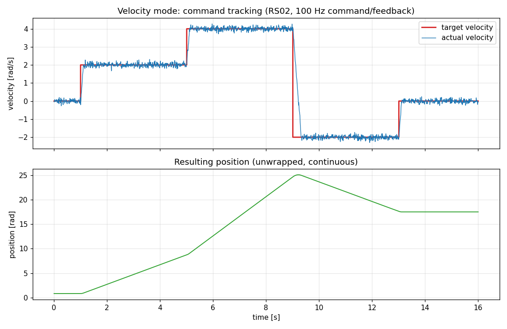
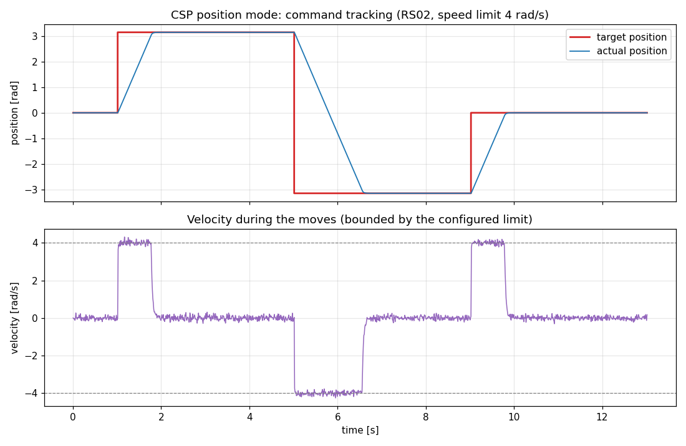

# robstride_driver

[](https://github.com/masayuki-kono/robstride_driver/actions/workflows/ci.yml)
[](https://github.com/masayuki-kono/robstride_driver/actions/workflows/lint.yml)

[](LICENSE)

A ROS-independent C++ driver library for [RobStride](https://www.robstride.com/) quasi-direct-drive motors over Linux SocketCAN or the official RobStride USB-CAN module.

## Features

- Pure C++20 / CMake library — no ROS or other framework dependencies
- Three transports:
  - Linux SocketCAN (`PF_CAN` / `SOCK_RAW`), works with any SocketCAN-compatible USB-CAN adapter
  - The official RobStride USB-CAN module (CH340 serial bridge, AT framing, 921600 baud)
  - `StubCanInterface`, an in-process motor simulator for running applications without hardware (per-axis mixing with real transports is possible)
- Implements the RobStride private CAN protocol (29-bit extended frames, 1 Mbps)
- High-level motor API: enable/disable, velocity mode, CSP position mode, operation (MIT) control, feedback parsing, parameter read/write, mechanical zero
- `PositionUnwrapper` helper that converts the wrapped feedback position (±4π on RS02) into a continuous position
- Transport abstraction (`CanInterface`) so the protocol and motor logic are unit-testable without hardware
- Validated against the **RobStride RS02**; range tables for RS00–RS06 are included

## Tracking performance (RS02, real hardware)

Measured on an unloaded, as-delivered RS02 (see [docs/test_results.md](docs/test_results.md) for preconditions and how to reproduce with the `examples/tracking_capture_<mode>.cpp` programs).

Velocity mode — the actual velocity follows step commands (0 → +2 → +4 → −2 → 0 rad/s) with a steady-state mean error below 0.3 %:



CSP position mode — π-sized position steps are executed as constant-speed ramps bounded by the configured 4 rad/s limit, with a steady-state error below 0.002 rad:



See [docs/test_results.md](docs/test_results.md) for the test setup, detailed statistics and the results of the remaining control modes (PP position, current, operation/MIT control).

## Supported motors

| Model | Status |
|-------|--------|
| RS02  | Primary target, validated against the official RS02 User Manual |
| RS00, RS01, RS03, RS04, RS05, RS06 | Range tables included (from vendor sample code, not hardware-verified) |

## Requirements

- Linux with SocketCAN support (mainline kernel)
- CMake >= 3.16, a C++20 compiler
- GoogleTest (optional, for unit tests): `sudo apt install libgtest-dev`
- `can-utils` (recommended, for bus debugging): `sudo apt install can-utils`

## Quick start

### Build

```bash
cmake -S . -B build -DCMAKE_BUILD_TYPE=Release
cmake --build build
ctest --test-dir build          # run unit tests
sudo cmake --install build      # optional
```

### Bring up the CAN interface

For a SocketCAN adapter:

```bash
sudo ip link set can0 type can bitrate 1000000
sudo ip link set can0 up
```

For the RobStride USB-CAN module, no interface setup is needed — it appears as a serial device (e.g. `/dev/ttyUSB0`); make sure your user can access it (`dialout` group).

See [docs/setup.md](docs/setup.md) for persistent configuration and a virtual-CAN smoke test.

### Minimal code example

```cpp
#include <robstride_driver/robstride_driver.hpp>

int main() {
  auto can = std::make_shared<robstride::SocketCanInterface>("can0");
  can->set_motor_id_filter(0x01);
  // ... or, with the RobStride USB-CAN module:
  // auto can = std::make_shared<robstride::AtSerialCanInterface>("/dev/ttyUSB0");

  robstride::RobstrideMotor::Config config;
  config.motor_id = 0x01;
  config.actuator_type = robstride::ActuatorType::Rs02;
  robstride::RobstrideMotor motor(can, config);

  motor.set_run_mode(robstride::RunMode::Velocity);
  motor.enable();
  motor.configure_velocity_mode(/*current_limit=*/10.0, /*acceleration=*/20.0);

  auto feedback = motor.send_velocity_command(2.0);  // rad/s
  // feedback.position / velocity / torque / temperature / fault

  motor.send_velocity_command(0.0);
  motor.disable();
}
```

A complete velocity-control CLI is provided in [examples/velocity_control.cpp](examples/velocity_control.cpp):

```bash
./build/examples/velocity_control can0 1 2.0 3.0          # SocketCAN
./build/examples/velocity_control /dev/ttyUSB0 1 2.0 3.0  # RobStride USB-CAN module
```

### Using from CMake

```cmake
find_package(robstride_driver REQUIRED)
target_link_libraries(your_target robstride_driver::robstride_driver)
```

The repository also ships a `package.xml` (`<build_type>cmake</build_type>`) so it can be dropped into a ROS 2 (e.g. Jazzy) colcon workspace as-is. For a ROS 2 usage example see the `robstride_motor_control` package in the CleanRobotController project.

## Documentation

| Document | Contents |
|----------|----------|
| [docs/hardware.md](docs/hardware.md) | Assumed hardware setup: RS02 motor, USB-CAN adapter, wiring, termination, multi-motor bus |
| [docs/setup.md](docs/setup.md) | Host setup: SocketCAN configuration, persistence, vcan testing |
| [docs/architecture.md](docs/architecture.md) | Library layering, class responsibilities, error handling, test strategy |
| [docs/protocol.md](docs/protocol.md) | RobStride private CAN protocol summary (frame layouts, parameter table) |
| [docs/test_results.md](docs/test_results.md) | Hardware-in-the-loop command-tracking results (all control modes) |

## Development

CI builds the library with gcc and clang and runs the unit tests
([ci.yml](.github/workflows/ci.yml)); a separate workflow checks
clang-format, clang-tidy and ruff ([lint.yml](.github/workflows/lint.yml)).
Pull requests are also reviewed by [CodeRabbit](https://coderabbit.ai).

To run the same formatters and linters locally, install
[pre-commit](https://pre-commit.com/) and register the git hook once:

```bash
pipx install pre-commit    # or: pip install pre-commit
pre-commit install         # runs the hooks on every commit
pre-commit run --all-files # or run them on the whole tree
```

The individual tools can also be invoked directly:

```bash
clang-format -i src/*.cpp include/robstride_driver/*.hpp tests/*.cpp examples/*.cpp examples/*.hpp
cmake -S . -B build -DCMAKE_BUILD_TYPE=Release -DCMAKE_EXPORT_COMPILE_COMMANDS=ON
clang-tidy -p build src/*.cpp examples/*.cpp tests/*.cpp
ruff check tools/ && ruff format tools/
```

Agent-oriented contributor notes (build commands, style, verification
steps) live in [AGENTS.md](AGENTS.md).

## License

[MIT](LICENSE)
