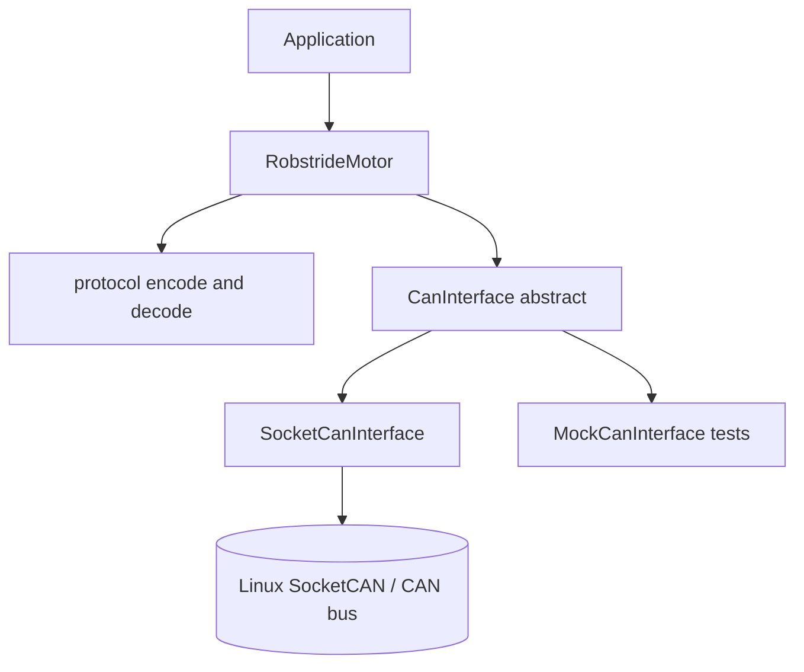

# Architecture

`robstride_driver` is layered so that the protocol logic is pure and unit-testable, and the hardware transport is replaceable.

## Layers

### `protocol.hpp` / `protocol.cpp` — pure frame codec

- Free functions that build command frames (`MakeEnableFrame`, `MakeWriteParamFrame`, `MakeMotionControlFrame`, ...) and parse response frames (`ParseFeedback`, `ParseParamResponse`).
- Operates only on the transport-neutral `CanFrame` value type (29-bit id + 8 data bytes). No I/O, no state — fully covered by unit tests.
- `FloatToUint` / `UintToFloat` implement the linear 16-bit fixed-point scaling used by motion-control and feedback frames.

### `actuator_types.hpp` — per-model ranges

- `ActuatorType` (RS00–RS06) and `ActuatorLimits` (position/velocity/torque/Kp/Kd ranges) used for fixed-point scaling.
- RS02 values are cross-checked against the official RS02 User Manual; the other models come from vendor sample code.

### `CanInterface` — transport abstraction

- Two operations: `Send(frame)` and `Receive(timeout)`.
- `SocketCanInterface` is the production implementation (raw SocketCAN socket, extended frames only, optional kernel-side filter on the source motor id).
- Tests substitute a scripted mock; other transports (e.g. a remote CAN bridge) can be added without touching motor logic.

### `RobstrideMotor` — high-level API

- One instance per motor (`motor_id`, `host_id`, `ActuatorType`, response timeout).
- Every command is a synchronous **send → wait for matching response** exchange:
  - Most commands are answered by a feedback frame (communication type 2), which is returned to the caller and cached in `last_feedback()`.
  - Parameter reads are answered by a type-17 response.
  - Frames from other motors are skipped; unexpected feedback frames still update the cache.
  - A missing response raises `TimeoutError`.
- Mode changes follow the manual's requirement to stop the motor first: `SetRunMode` = stop → write `run_mode` → read back and verify. The motor is left disabled so the caller controls when it re-enables.

## Threading model

The library itself is single-threaded and non-blocking beyond the configured response timeout:

- `RobstrideMotor` is **not** thread-safe; serialize calls per instance.
- Multiple `RobstrideMotor` instances may share one `CanInterface` only if all calls are externally serialized (responses are matched by motor id, and non-matching frames are discarded — a concurrent exchange could steal another motor's frame).
- The simplest multi-motor pattern is one control thread that services all motors in a loop, which also matches the synchronous request/response nature of the protocol.

## Error handling

- Transport failures (`socket`, `bind`, `write`, ...) throw `std::system_error` with errno context.
- Protocol timeouts throw `robstride::TimeoutError`.
- Motor fault bits (undervoltage, overcurrent, overtemperature, magnetic encoding, stall overload, uncalibrated) are surfaced in every `Feedback` via `FaultStatus`; the library reports them but does not decide policy — that belongs to the application.

## Test strategy

- `tests/test_protocol.cpp`: frame encoding byte layouts (verified against worked examples from the RS02 User Manual), scaling round trips, feedback/parameter decoding, fault-bit extraction.
- `tests/test_robstride_motor.cpp`: command/response sequencing against `MockCanInterface` — mode-switch sequence, response matching, timeout behavior, feedback caching.
- Hardware-in-the-loop verification uses `examples/velocity_control.cpp` on a real bus.
