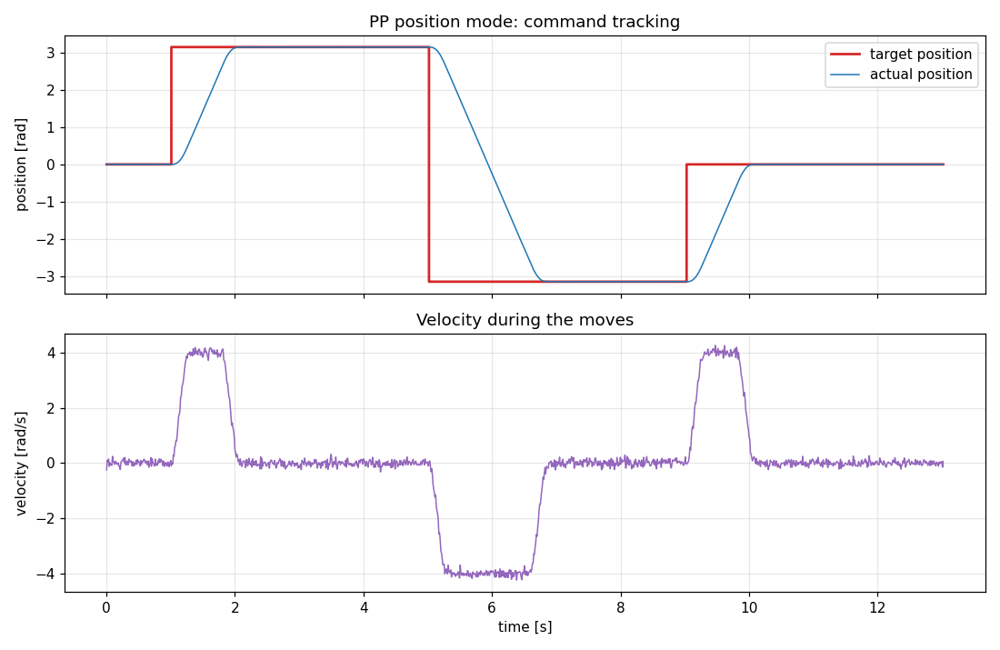
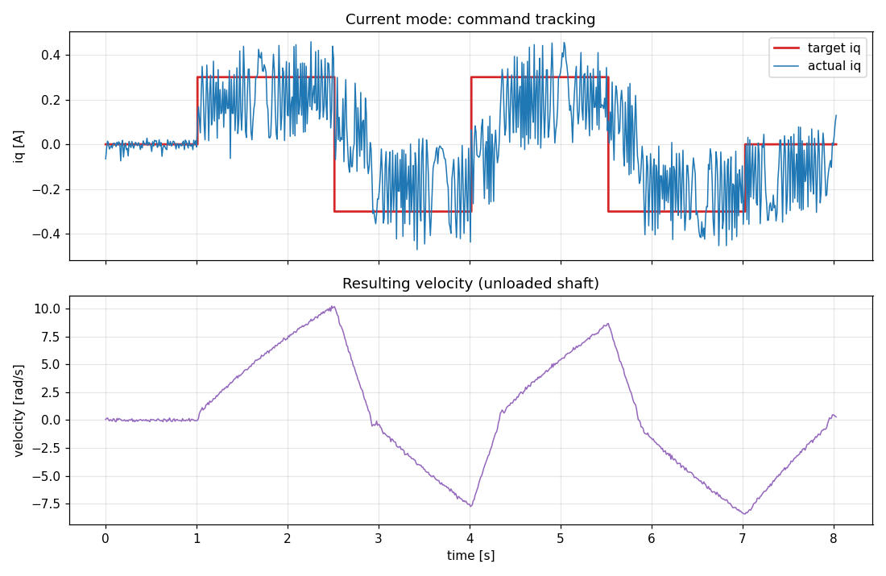
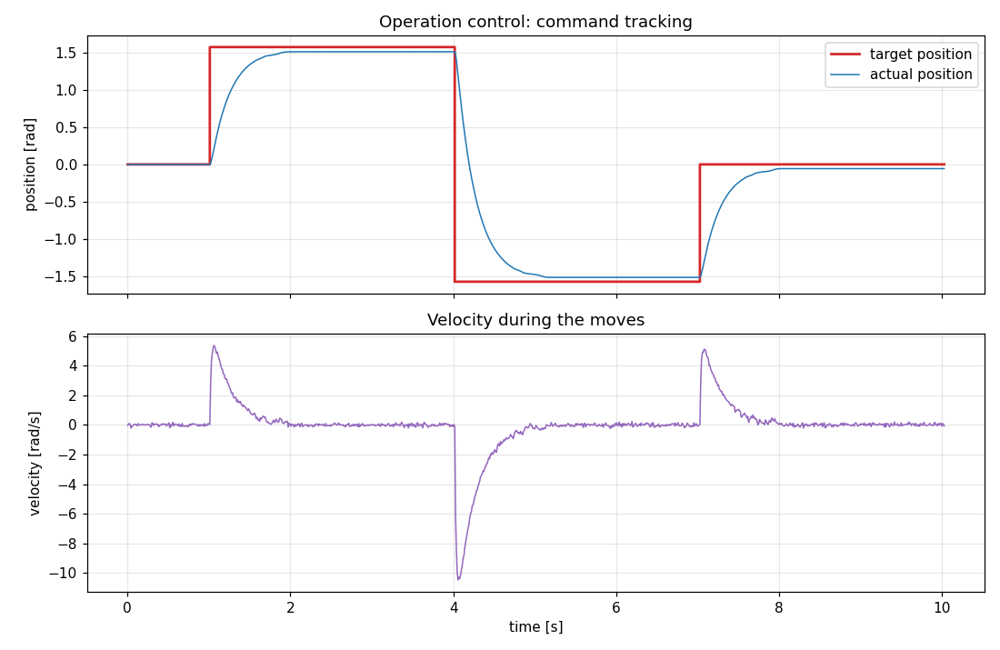
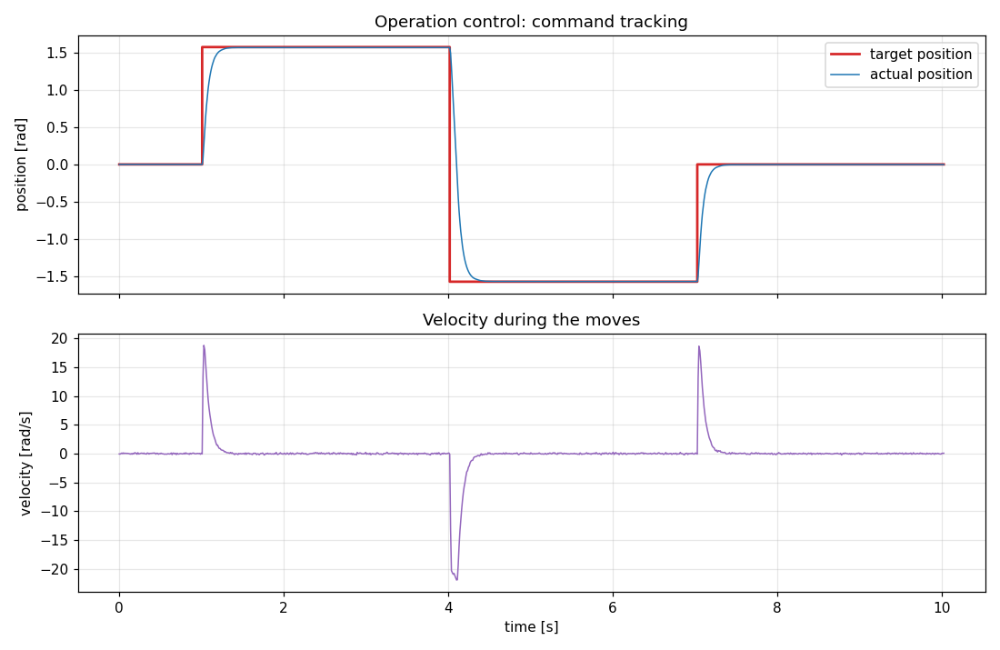

# Command-Tracking Test Results

Hardware-in-the-loop results showing that the actual motor state follows the
commands sent through this driver, in all control modes: velocity, CSP
position, PP position, current and operation (MIT) control.

## Preconditions

- The motor output shaft carries **no external load** and is free to rotate
  (bench test in the as-delivered condition).
- The motor is in its **factory-default state**: motor id 127, no persisted
  parameter changes. All mode/limit parameters used below are written
  volatilely by the capture program at run time.

Results under load will differ, especially the transient response and the
torque readings.

## Test setup

| Item | Value |
|------|-------|
| Motor | RobStride RS02 (motor id 127, factory default) |
| Transport | Official RobStride USB-CAN module (`AtSerialCanInterface`, `/dev/ttyUSB0`, 921600 baud) |
| Command / feedback rate | 100 Hz (every command's feedback response is recorded) |

Each command sent by `RobstrideMotor` is answered by a feedback frame
(communication type 2) carrying the measured position, velocity, torque and
temperature; the plots below record that feedback for every cycle. Positions
are made continuous with `PositionUnwrapper`.

## Velocity mode

Step profile 0 → +2 → +4 → −2 → 0 rad/s (via `send_velocity_command`, current
limit 10 A, acceleration 20 rad/s²):


Steady-state statistics per plateau (transients of 1.5 s excluded):

| Target [rad/s] | Mean actual [rad/s] | Max abs error [rad/s] |
|---------------|---------------------|------------------------|
| +2.0 | +1.998 | 0.31 |
| +4.0 | +4.005 | 0.26 |
| −2.0 | −2.003 | 0.30 |
| 0.0 | −0.002 | 0.25 |

- The mean velocity matches the target within 0.3 % on every plateau.
- Steps settle in well under 0.5 s (limited by the configured 20 rad/s²
  acceleration).
- The residual ±0.3 rad/s band is measurement ripple of the velocity
  estimate, not a control offset — the resulting position ramps are straight.

## CSP position mode

Step profile 0 → +π → −π → 0 rad (via `send_position_csp_command` semantics:
`limit_spd` = 4 rad/s, then `loc_ref` steps). The motor was zeroed with
`set_mechanical_zero()` before the run:


Steady-state statistics per plateau (transients of 2 s excluded):

| Target [rad] | Mean actual [rad] | Max abs error [rad] |
|--------------|-------------------|----------------------|
| +3.142 | +3.1405 | 0.0017 |
| −3.142 | −3.1408 | 0.0013 |
| 0.000 | −0.0002 | 0.0006 |

- Steady-state position error is below 0.002 rad (≈ 0.1°).
- During the moves the velocity is bounded by the configured 4 rad/s limit
  (lower plot), giving a constant-speed ramp between targets.

## PP position mode

Same step profile 0 → +π → −π → 0 rad, executed in profile-position mode
(run_mode 1, `vel_max` = 4 rad/s, `acc_set` = 20 rad/s², then `loc_ref`
steps). The motor was zeroed with `set_mechanical_zero()` before the run:



Steady-state statistics per plateau (transients of 2 s excluded):

| Target [rad] | Mean actual [rad] | Max abs error [rad] |
|--------------|-------------------|----------------------|
| +3.142 | +3.1406 | 0.0017 |
| −3.142 | −3.1411 | 0.0013 |
| 0.000 | −0.0001 | 0.0006 |

- Steady-state accuracy matches CSP mode (error below 0.002 rad).
- The motor plans a trapezoidal profile itself: the velocity ramps to the
  configured 4 rad/s `vel_max` with the 20 rad/s² `acc_set` (lower plot),
  instead of the constant-speed ramp of CSP mode.

## Current mode

Step profile 0 → +0.3 → −0.3 → +0.3 → −0.3 → 0 A (run_mode 3, `iq_ref`
steps). Beside the regular feedback, each cycle also reads the filtered Iq
(parameter `iqf`, 0x701A), which is what the upper plot tracks:



Steady-state statistics per plateau (transients of 0.5 s excluded):

| Target [A] | Mean actual Iq [A] | Max abs error [A] |
|-----------|--------------------|--------------------|
| +0.3 | +0.23 | 0.28 |
| −0.3 | −0.18 | 0.33 |
| +0.3 | +0.21 | 0.32 |
| −0.3 | −0.22 | 0.31 |
| 0.0 | −0.09 | 0.30 |

- The commanded Iq is a torque command; on an unloaded shaft it simply
  accelerates the rotor, so the velocity ramps up and down between the
  steps (lower plot) — this is the expected physical response.
- The measured Iq carries a large ripple band (±0.3 A) at this small
  command amplitude, and its mean stays somewhat below the target while
  the rotor accelerates. Under a real load (stalled or driving a mass)
  the current tracking is expected to be much cleaner; these unloaded
  numbers mainly document the qualitative behavior.

## Operation (MIT) control

Step profile 0 → +π/2 → −π/2 → 0 rad as position targets of the motion
command (communication type 1), with Kp = 4, Kd = 1, zero velocity target
and zero torque feed-forward. The motor was zeroed with
`set_mechanical_zero()` before the run:



Steady-state statistics per plateau (transients of 1.5 s excluded):

| Target [rad] | Mean actual [rad] | Max abs error [rad] |
|--------------|-------------------|----------------------|
| +1.571 | +1.509 | 0.062 |
| −1.571 | −1.513 | 0.058 |
| 0.000 | −0.057 | 0.057 |

- Operation control is an impedance (PD) law computed inside the motor:
  `t_ref = Kd·(v_set − v) + Kp·(p_set − p) + t_ff`. With a pure
  proportional gain there is no integral action, so a small steady-state
  offset (≈ 0.06 rad at Kp = 4) remains where the PD torque balances
  friction — this is inherent to the control law, not a driver error.
- The step response is smooth and well damped with Kd = 1; higher Kp
  reduces the offset, as shown next.

### Effect of gain tuning (Kp = 30, Kd = 2)

The offset above is a gain-tuning issue, not a limitation of the mode.
Re-running the identical profile with a stiffer proportional gain and
slightly more damping (Kp = 30, Kd = 2, passed as the optional gain
arguments of `tracking_capture_operation`) brings the actual position
waveform onto the target:



Steady-state statistics per plateau (transients of 1.5 s excluded):

| Target [rad] | Mean actual [rad] | Max abs error [rad] |
|--------------|-------------------|----------------------|
| +1.571 | +1.5646 | 0.0063 |
| −1.571 | −1.5683 | 0.0029 |
| 0.000 | −0.0021 | 0.0025 |

Compared to the Kp = 4 run:

| | Kp = 4, Kd = 1 | Kp = 30, Kd = 2 |
|---|---|---|
| Steady-state offset | ≈ 0.06 rad | ≈ 0.006 rad |
| Settling behavior | slow first-order approach (≈ 1 s) | fast, no overshoot (≈ 0.3 s) |
| Peak transient velocity | ≈ 10 rad/s | ≈ 20 rad/s |

- Raising Kp 4 → 30 shrinks the friction-induced offset by the same
  factor (the PD torque needed to balance friction is reached at a 7.5×
  smaller position error).
- The extra damping (Kd = 2) keeps the faster response overshoot-free;
  the cost is a stiffer joint and a higher transient velocity/torque
  demand, which matters once the joint carries a load.

## Reproducing

The capture programs are part of the examples (one per control mode,
`examples/tracking_capture_<mode>.cpp`, sharing
[examples/tracking_capture_common.hpp](../examples/tracking_capture_common.hpp));
each runs the exact profile above and logs every command's feedback to CSV.
The plots and the statistics tables are generated by
[tools/plot_tracking.py](../tools/plot_tracking.py) (requires matplotlib).

```bash
cmake -S . -B build -DCMAKE_BUILD_TYPE=Release
cmake --build build

# capture (motor spins!) — pass a SocketCAN interface or the serial device
./build/examples/tracking_capture_velocity  /dev/ttyUSB0 127 velocity_tracking.csv
./build/examples/tracking_capture_position  /dev/ttyUSB0 127 position_tracking.csv
./build/examples/tracking_capture_pp        /dev/ttyUSB0 127 pp_tracking.csv
./build/examples/tracking_capture_current   /dev/ttyUSB0 127 current_tracking.csv
./build/examples/tracking_capture_operation /dev/ttyUSB0 127 operation_tracking.csv
# operation control takes optional gain arguments: [kp] [kd] (default 4 / 1)
./build/examples/tracking_capture_operation /dev/ttyUSB0 127 operation_tracking_kp30.csv 30 2

# plot + statistics
python3 tools/plot_tracking.py velocity  velocity_tracking.csv  docs/images/velocity_tracking.png
python3 tools/plot_tracking.py position  position_tracking.csv  docs/images/position_tracking.png
python3 tools/plot_tracking.py pp        pp_tracking.csv        docs/images/pp_tracking.png
python3 tools/plot_tracking.py current   current_tracking.csv   docs/images/current_tracking.png
python3 tools/plot_tracking.py operation operation_tracking.csv docs/images/operation_tracking.png
python3 tools/plot_tracking.py operation operation_tracking_kp30.csv docs/images/operation_tracking_kp30.png
```

Note: the position-based captures (position, pp, operation) set the current
position as mechanical zero (`set_mechanical_zero()`) so the recorded
positions are relative to the start.
